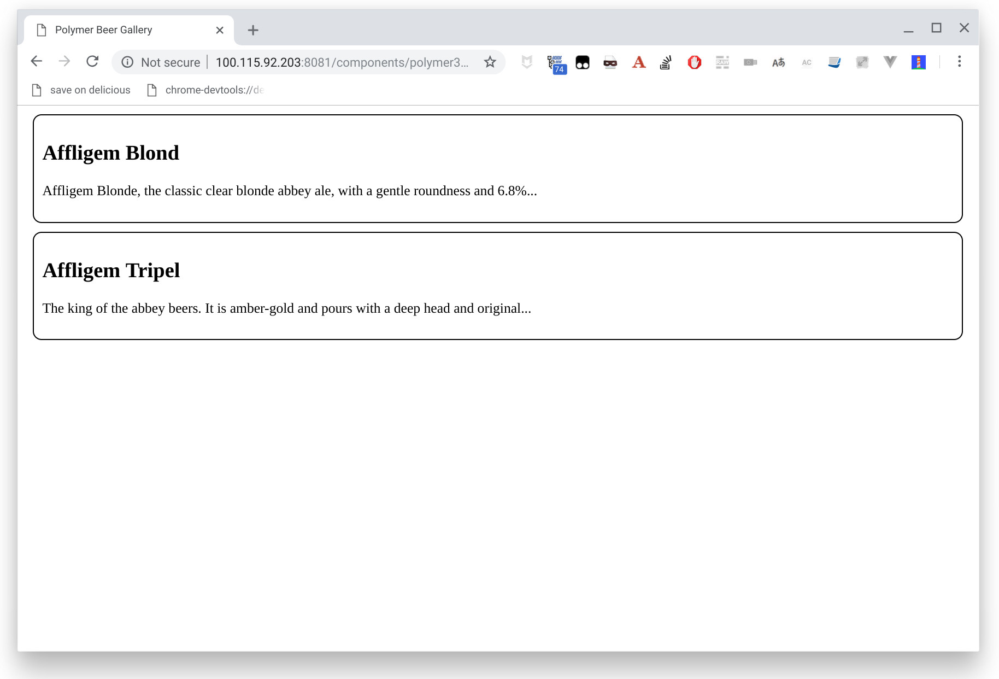

#  Polymer Beers - Polymer tutorial - Step 02

In this step we are going to use our first Polymer element, a very simple custom `beer-list-item`.
By using it you will see how easily you can add Polymer widgets to your normal web applications.

## Dependencies ##

In this step we are adding two dependencies, Polymer to get the WebComponents polyfill and the Polymer library core fun functionalities, and Bootstrap to make our app prettier.

Let's begin  by creating a new `package.json`: 

```json
{
  "name": "polymer3-beers",
  "version": "1.0.0",
  "description": "Polymer beers tutorial",
  "main": "index.js",
  "author": "Horacio Gonzalez <horacio.gonzalez@gmail.com>",
  "license": "MIT"
}
```

And add the Polymer dependency using `npm`:

```bash
npm install @polymer/polymer
```

You should get something like:

<pre style="background-color: #300A24;"><code>
$ npm install @polymer/polymer
npm WARN polymer3-beers@1.0.0 No repository field.

+ @polymer/polymer@3.1.0
added 2 packages from 2 contributors and audited 2 packages in 1.251s
found 0 vulnerabilities

</code></pre>

And the [`granite-bootstrap`]() package to have Bootstrap inside your Shadow DOM:

```bash
npm install @granite-elements/granite-bootstrap
```

## The custom element

We are adding a custom `beer-list-item` Polymer element that will be stored in the `elements` folder.

Polymer allows us to quicky define and declare custom elements. 
Custom elements provide a component model for the web. 
The custom elements specification provides:

- A mechanism for associating a class with a custom element name.
- A set of lifecycle callbacks invoked when an instance of the custom element changes state (for example, added or removed from the document).
- A callback invoked whenever one of a specified set of attributes changes on the instance.

Put together, these features let you build an element with its own public API that reacts to state changes. Polymer provides a set of features on top of the basic custom element specification.

## The `BeerListItem` custom element

To define a custom element, create a class that extends PolymerElement and pass the class to the customElements.define method.

By specification, the custom element's name must start with a lower-case ASCII letter and must contain a dash (`-`).

```js
// Import PolymerElement class
import {PolymerElement} from '@polymer/polymer/polymer-element.js';

// Define the element's class element
export class BeerListItem extends PolymerElement {

  // Element class can define custom element reactions
  connectedCallback() {
    super.connectedCallback();
    console.log('my-element created!');
  }

  ready() {
    super.ready();
    console.log('my-element is ready!');
  }
}

// Associate the new class with an element name
customElements.define('beer-list-item', BeerListItem);
```

A fully defined Polymer element usually has a `template` property as a class getter.
This `template` will return an HTML [template literal](https://developer.mozilla.org/en-US/docs/Web/JavaScript/Reference/Template_literals).

It also has a `properties` class getter, that return the observable properties that cause the 
element to update.

In our case we need two properties, `name` and `description`, and a template that renders the beer
in a more beautiful way than step 01:

```js
// Import PolymerElement class and html helper definition
import {PolymerElement, html} from '@polymer/polymer/polymer-element.js';

// Define the element's class element
export class BeerListItem extends PolymerElement {

  static get template() {
    return html`
      <style>
        .beer {
          margin: 10px;
          padding: 10px;
          border: solid 1px black;
          border-radius: 10px;
          min-height: 50px;
        }
      </style>
      <div class="beer">
        <h2>[[name]]</h2>
        <p>[[description]]</p>
      </div>
    `;
  }

  static get properties() {
    return {
      name: {
        type: String,
      },
      description: {
        type: String,
      }
    }
  }

  // Element class can define custom element reactions
  connectedCallback() {
    super.connectedCallback();
    console.log('my-element created!');
  }

  ready() {
    super.ready();
    console.log('my-element is ready!');
  }
}

// Associate the new class with an element name
customElements.define('beer-list-item', BeerListItem);
```

You will get (lots of) more details on custom element definition on further steps, by now this should be enough.


## Using Polymer elements

Using Polymer elements in your HTML is quick and painless, you only need to follow these steps:


1. Import the elements you want to use, i.e. `beer-list-item`
  ```html
  <!-- Import `beer-list-item` element -->
  <script type="module" src="./elements/beer-list-item.js">
  ```

1. Use the element as a new HTML tag
  ```html
  <beer-list-item
    name="Affligem Blond"
    description="Affligem Blonde, the classic clear blonde abbey ale, with a gentle roundness and 6.8%..."
  ></beer-list-item>
  
  <beer-list-item
    name="Affligem Tripel"
    description="The king of the abbey beers. It is amber-gold and pours with a deep head and original..."
  ></beer-list-item>
  ```


## What must I do?

You're going to replace the `<ul>` and the `<li>` items that you created in [step-01](../step-01/) with two `beer-list-item` elements, one for each beer.

In order to do it, you need to follow the steps previously described in *Using Polymer elements*, loading the polyfill and importing the `beer-list-item` element in the header section of `index.html` and then using the newly registered `<beer-list-item>` in the HTML body for both beers.

Then you need to call `polymer serve` on the `app` folder:

<pre style="background-color: #300A24;"><code>
$ polymer serve --npm
info: [cli.command.serve]    Files in this directory are available under the following URLs
      applications: http://127.0.0.1:8081
      reusable components: http://127.0.0.1:8081/components/polymer3-beers/
</code></pre>

And then you go to the app address (http://127.0.0.1:8081/components/polymer3-beers/) to test your component:





## Local DOM and data binding  ##

Data binding binds a property or sub-property of a custom element (the host element) to a property or attribute of an element in its local DOM (the child or target element).

The standard way to create the binding in Polymer 3.x is using the `template` getter.
In this template literal we generate an HTML entity using a JS template literal, where we can call for the objects properties using the data-binding syntax (`[[property_name]]`).

The binding is then done as the `template` is called after any property change is detected.

```js
  static get template() {
    return html`
      <style>
        .beer {
          margin: 10px;
          padding: 10px;
          border: solid 1px black;
          border-radius: 10px;
          min-height: 50px;
        }
      </style>
      <div class="beer">
        <h2>[[name]]</h2>
        <p>[[description]]</p>
      </div>
    `;
  }
```

To bind to a child property, specify the attribute name that corresponds to the property, with an annotation as the attribute value:

```html
<beer-list-item
  name="Affligem Tripel"
  description="The king of the abbey beers. It is amber-gold and pours with a deep head and original..."
></beer-list-item>
```

Here we are defining an instance of `beer-list-item`  component binding the component `name` property to `"Affligem Tripel"` and the `description` to `"The king of the abbey beers. It is amber-gold and pours with a deep head and original..."`.

For more information about DOM templating, see the [Polymer documentation](https://www.polymer-project.org/3.0/docs/devguide/dom-template)


## Declared properties ##

Any property that’s part of your element’s public API should be declared in the object returned by the `properties` getter  of the custom element.

In this `properties` object you associated the property name to a string defining the property type or to an object describing more details of the property.

```js
  static get properties() {
    return {
      name: {
        type: String,
      },
      description: {
        type: String,
      }
    }
  }
```

For more information about properties, see the [Polymer documentation](https://www.polymer-project.org/3.0/docs/devguide/properties)


## Additional experiments

Try modifying the element to show the beer name in red.

You will see that you need to do it inside the `style` block of the `template` getter for the element. Following the encapsulation principle, global CSS rules don't pass the element frontier.

## Summary

You have added a Polymer custom web component to an otherwise static app. Now go to [step-03](../step-03/) to see how to create another element to automatically generate the beer list.
