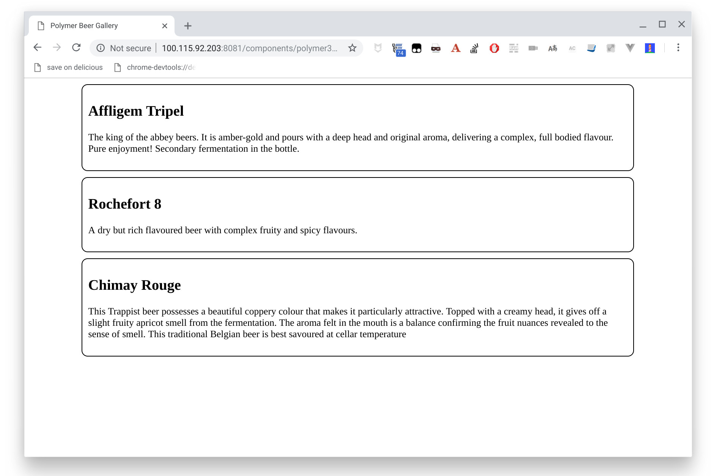

#  Polymer Beers - Polymer tutorial - Step 03

In this step we are going to create a more complex Polymer element, a custom `beer-list`.
This element will use a JavaScript array as model and automatically generate a `beer-list-item` for each beer in the array.


## Creating the element file

We begin by creating a new file for the element, `elements/beer-list.js`. Inside it we put a basic Polymer element definition:


```js
import {PolymerElement, html} from '@polymer/polymer/polymer-element.js';

// We are going to use `beer-list-item`, so we import it
import './beer-list-item.js';

export class BeerLits extends PolymerElement {

    static get template() {
      return html`
      `;
    }
  
    static get properties() {
      return {
      }
    }
  
  }
  
  customElements.define('beer-list', BeerList);
```


## Defining the model

We are going to model our (ever growing) beer collection as a JavaScript array in our `beer-list` element.
We will use the element's `constructor`, that is often used to initialize variables.

```js
export class BeerLis extends PolymerElement {

  static get template() {
    return html`
      `;
  }

  static get properties() {
    return {
      beers: {
        type: Array,
      },
    }
  }

  constructor() {
    super();

    this.beers = [
      {
        alcohol: 8.5,
        name: "Affligem Tripel",
        description: "The king of the abbey beers. It is amber-gold and pours with a deep head and original aroma, delivering a complex, full bodied flavour. Pure enjoyment! Secondary fermentation in the bottle."
      },
      {
        alcohol: 9.2,
        name: "Rochefort 8",
        description: "A dry but rich flavoured beer with complex fruity and spicy flavours."
      },
      {
        alcohol: 7,
        name: "Chimay Rouge",
        description: "This Trappist beer possesses a beautiful coppery colour that makes it particularly attractive. Topped with a creamy head, it gives off a slight fruity apricot smell from the fermentation. The aroma felt in the mouth is a balance confirming the fruit nuances revealed to the sense of smell. This traditional Belgian beer is best savoured at cellar temperature "
      }
    ];
  }
}
```


So now we have a `beers` property in our element, that can be access in the JS side using `this.beers` and in the `template` side using  `[[beers]]`.

As you can see, for each beer we have the `name` and `description` properties that `beer-list-item` needs, and also added an `alcohol` property that our element isn't capable to use yet.


## Data-binding

A reasonable thing to do for our `beer-list` would be to spawn a `beer-list-element` for each beer in the `beers` array. How can we do that? By using Polymer's [data binding helper element](https://www.polymer-project.org/1.0/docs/devguide/templates.html), concretely a template repeater (`dom-repeat`).

In order to use `dom-repeat` you need to import it:

```js
// Import template repeater
import '@polymer/polymer/lib/elements/dom-repeat.js';
```

And then you can use it in the element template:

```js
  static get template() {
    return html`
      <style>
        /* CSS rules for your element */
      </style>
      <div class="beers">
        <template is="dom-repeat" items="{{beers}}">
          <beer-list-item name="{{item.name}}" description="{{item.description}}">
          </beer-list-item>
        </template>
      </div>
    `;
```

The template repeater is a specialized template that binds to an array. It creates one instance of the template’s contents for each item in the array. It adds two properties to the binding scope for each instance:

- `item`: The array item used to create this instance
- `index`: The index of item in the array

For more information about the template repeater, see the [Polymer documentation](https://www.polymer-project.org/3.0/docs/devguide/templates#dom-repeat).


## Using the new element

In the `index.html` file we aren't going to use directly `beer-list-item` elements anymore, but a simple `beer-list`.
Let's replace the import of `beer-list-item` by an import of `beer-list`:

```html
<!-- Import `beer-list` element -->
  <script type="module" src="./elements/beer-list.js"></script>
```

And use it in the body:

```html
  <beer-list></beer-list>
```

## Let's add some Bootstrap

We can now use [`granite-bootstrap`](https://github.com/lostinbrittany/granite-bootstrap) to add Bootstrap look and feel
to your component.

You begin  by importing `granite-bootstrap`:

```js
import '@granite-elements/granite-bootstrap/granite-bootstrap.js';
```

and then, inside your component, use granite-bootstrap as shared style:

```js
  static get template() {
    return html`
      <style include="granite-bootstrap"></style>
      <div class="beers container">
        <template is="dom-repeat" items="{{beers}}">
          <beer-list-item name="{{item.name}}" description="{{item.description}}">
          </beer-list-item>
        </template>
      </div>
    `;
  }
```

So no the beers are rendered inside a Bootstrap [container](https://getbootstrap.com/docs/4.1/layout/overview/#containers) element, as you can see with the margins.




## Aditionnal experiments

### Make the `beer-list` element show the number of beers in the list.

In the element's `template` you have access to the beers variable, you can then get it's size and show it after the beers:

```html
<div>Number of beers in list: [[beers.length]]</div>
```

### Play with `dom-repeat`

Create a repeater in `beer-list` that constructs a simple table:

```html
<table>
  <tr><th>Row number</th></tr>
  <template is="dom-repeat" items="[0, 1, 2, 3, 4, 5, 6, 7]">
    <tr><td>{{item}}</td></tr>
  </template>
</table>
```

Extra points: try and make an 8x8 table using an additional `dom-repeat`.

*Note: To access properties from nested `dom-repeat` templates, use the `as` attribute to assign a different name for the item property. Use the `index-as` attribute to assign a different name for the `index` property.*

## Summary ##

You now have a web application using Polymer web components.
Now, let's go to [step-04](../step-04/) to learn how to add full text search to the app.
