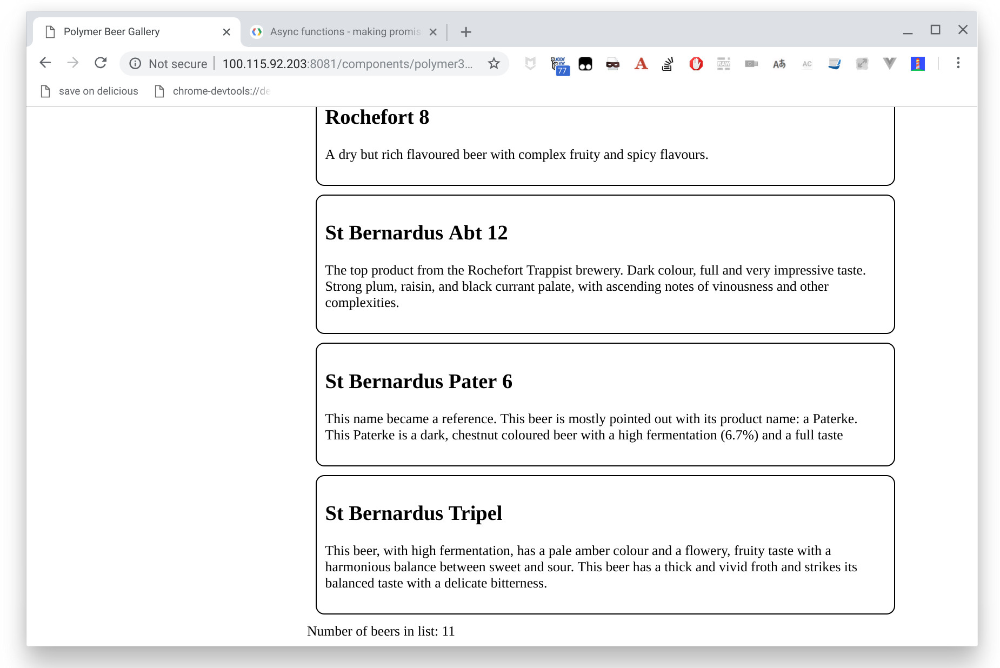
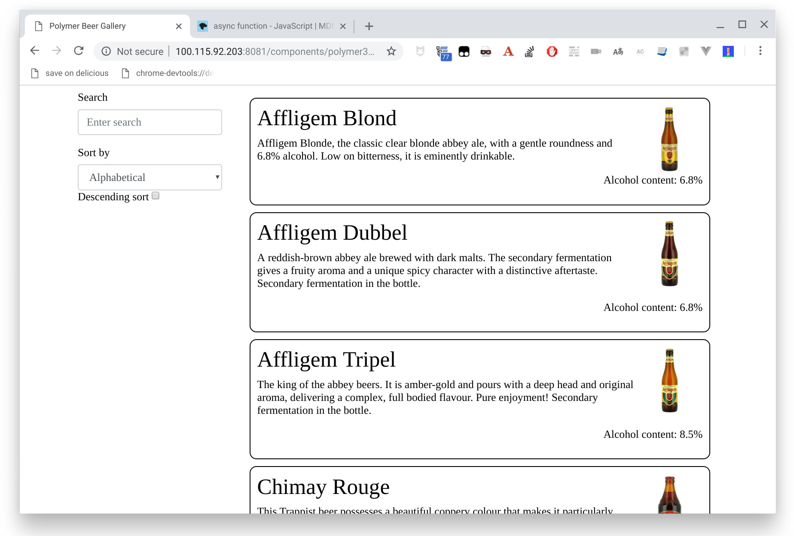

#  Polymer Beers - Polymer tutorial - Step 06

Enough of building an app with five beers in a hard-coded dataset! Let's fetch a larger dataset from our server using the [JavaScript Fetch API](https://developer.mozilla.org/en-US/docs/Web/API/Fetch_API).

## Data 

Our new dataset is now a list of 11 beers stored in JSON format in the `app/data/beers/beers.json`, available to your browser at the URL `http://127.0.0.1:8081/data/beers/beers.json`.


`app/data/beers/beers.json`:

```js
[
  ...
  {
    "alcohol": 6.8,
    "description": "A reddish-brown abbey ale brewed with dark malts. The secondary fermentation gives a fruity aroma and a unique spicy character with a distinctive aftertaste. Secondary fermentation in the bottle.",
    "id": "AffligemDubbel",
    "img": "beers/img/AffligemDubbel.jpg",
    "name": "Affligem Dubbel"
  },
  ...
]
```

## Fetch API

To get the JSON data from the server we are using the [JavaScript Fetch API](https://developer.mozilla.org/en-US/docs/Web/API/Fetch_API) to make an HTTP GET request to our web server, asking for `/data/beers/beers.json`. The server responds by providing the data in the JSON file. (The response might just as well have been dynamically generated by a backend server. To the browser and our app they both look the same. For the sake of simplicity we used a JSON file in this tutorial).

As the `fetch` operation is asynchronous, we are using the [`async/await`](https://developer.mozilla.org/en-US/docs/Web/JavaScript/Reference/Statements/async_function) syntax make the asynchronous code easier to read and write.

We want to call for the data as soon as our `beer-list` element get loaded, so we use the constructor:

```js
  constructor() {
    super();
    this.beers = [];
    ...
    _getData();
  }

  async _getData() {
    try {
      const response = await fetch('/data/beers/beers.json');
      this.beers = await response.json();
    }
    catch (err) {
      console.log('fetch failed', err);
    }
  }
```

And now you should have 11 beers in your collection:




## Showing more information

As now we recover more information for each beer (an id and an image URL), we are going to modify `beer-list-item` element to show it.

We begin by adding the missing properties:

```js
  static get properties() {
    return {
      id: {
        type: String,
      },
      name: {
        type: String,
      },
      description: {
        type: String,
      },
      img: {
        type: String,
      },
      alcohol: {
        type: String,
      },
    }
  }
```

Then we modify the template, displaying more information on each beer, anding add some CSS to make things prettier:

```js
  static get template() {
    return html`
      <style>
        .beer {
          margin: 10px;
          padding: 10px;
          border: solid 1px black;
          border-radius: 10px;
          min-height: 150px;
        }
        .el-img {
          max-height: 100px;
        }
        .el-alcohol {
          clear:both;
        }
      </style>
      <div id="[[id]]" class="beer clearfix">
        
        <h2 class="el-name">[[name]]</h2>
        <p class="el-description">[[description]]</p>
        <p class="float-right el-alcohol">Alcohol content: [[alcohol]]%</p>
      </div>
    `;
  }
```

We also want it to use Bootstrap, so as with `beer-item`, we import `granite-bootstrap` and use it as style:


```js
import '@granite-elements/granite-bootstrap/granite-bootstrap.js';
```


```js
  static get template() {
    return html`
      <style include="granite-bootstrap"></style>
      ...
    `;
  }
```

## Mapping the new information

In order to `beer-list-item` being able to display this new information, we also need to modify `beer-list` to map the information for each `beer-list-item`. Let's modify the template of `beer-list`:

```js
  <div class="col-md-9">
    <div class="beers">
      <template 
          id="beerList" is="dom-repeat" 
          items="[[beers]]" filter="_beerFilter" sort="_beerSorter">
        <beer-list-item 
            id="[[item.id]]"
            name="[[item.name]]" 
            description="[[item.description]]"
            img="[[item.img]]"
            alcohol="[[item.alcohol]]">
        </beer-list-item>
      </template>
    </div>
    <div>Number of beers in list: [[currentBeers]]</div>
  </div>    
```



## Summary ##

Now that you have loaded beer data from a server-side JSON file, go to [step 7](../step-07) to learn how to add the details of each beer.
